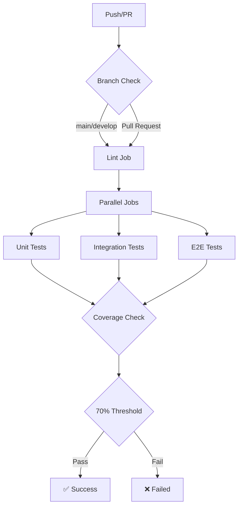

<!-- Parent: ../../AGENTS.md -->
<!-- Generated: 2026-02-27 | Updated: 2026-02-27 -->


**Parent Reference:** [../../AGENTS.md](../../AGENTS.md)

---

## Generated: 2026-02-27
**Purpose:** GitHub Actions CI/CD automation for BotSalinha — automated testing, linting, and quality assurance

## Key Files Table

| File | Purpose | When It Runs |
|------|---------|--------------|
| [test.yml](test.yml) | Main CI/CD pipeline | On push to main/develop, PRs |
| [AGENTS.md](AGENTS.md) | This documentation | Manual reference |

## Pipeline Overview

The CI/CD pipeline (`test.yml`) runs multiple jobs in parallel to ensure code quality and functional correctness:



### Job Dependencies
- `test-all` waits for all other jobs to complete
- Coverage threshold check only runs after all tests pass

## Job Definitions

### 1. **Lint Job**
```yaml
lint:
  name: Lint
  runs-on: ubuntu-latest
  timeout-minutes: 5
  steps:
    - Checkout code
    - Setup Python (3.12)
    - Install uv
    - Install dependencies
    - Run: ruff check src tests
    - Run: ruff format --check src tests
    - Run: mypy src (continue-on-error: true)
```

### 2. **Unit Tests Job**
```yaml
unit-tests:
  name: Unit Tests
  runs-on: ubuntu-latest
  timeout-minutes: 10
  steps:
    - Checkout code
    - Setup Python (3.12)
    - Install uv
    - Install dependencies
    - Run: pytest tests/unit -m "unit" with coverage
    - Upload coverage to Codecov
```

### 3. **Integration Tests Job**
```yaml
integration-tests:
  name: Integration Tests
  runs-on: ubuntu-latest
  timeout-minutes: 15
  steps:
    - Checkout code
    - Setup Python (3.12)
    - Install uv
    - Install dependencies
    - Run: pytest tests/integration -m "integration" with coverage
    - Upload coverage to Codecov
```

### 4. **E2E Tests Job**
```yaml
e2e-tests:
  name: E2E Tests
  runs-on: ubuntu-latest
  timeout-minutes: 20
  env:
    DISCORD_BOT_TOKEN: ${{ secrets.TEST_DISCORD_TOKEN }}
    GOOGLE_API_KEY: ${{ secrets.TEST_GEMINI_API_KEY }}
    DATABASE_URL: sqlite+aiosqlite:///:memory:
    APP_ENV: testing
  steps:
    - Checkout code
    - Setup Python (3.12)
    - Install uv
    - Install dependencies
    - Run: pytest tests/e2e -m "e2e" with coverage
    - Upload coverage to Codecov
```

### 5. **All Tests Job**
```yaml
test-all:
  name: All Tests
  runs-on: ubuntu-latest
  timeout-minutes: 30
  needs: [unit-tests, integration-tests, e2e-tests]
  steps:
    - Checkout code
    - Setup Python (3.12)
    - Install uv
    - Install dependencies
    - Run: pytest --parallel --numprocesses=auto -m "not slow"
    - Generate coverage summary
    - Upload coverage reports
    - Upload to Codecov
    - Check 70% coverage threshold (CI fails if below)
```

## AI Agent Instructions

When working with this pipeline:

1. **Always test locally first:**
   ```bash
   uv run ruff check src/
   uv run ruff format --check src/
   uv run mypy src/
   uv run pytest tests/unit
   uv run pytest tests/integration
   uv run pytest tests/e2e
   ```

2. **Ensure minimum coverage (70%) before merging**
3. **Respect test markers** — jobs use specific markers (unit, integration, e2e)
4. **Don't push broken tests** — CI will block the merge
5. **Check secrets** — E2E tests require `TEST_DISCORD_TOKEN` and `TEST_GEMINI_API_KEY`

## Common Patterns

### Adding New Test Types
1. Add new test marker in pytest.ini
2. Create new test directory (e.g., `tests/performance`)
3. Add job to test.yml matrix
4. Document in AGENTS.md

### Adding New Quality Checks
1. Add to lint job in test.yml
2. Add local run script in package.json or Makefile
3. Document new requirements in AGENTS.md

### Secret Management
- Discord bot token (for E2E tests): `TEST_DISCORD_TOKEN`
- Google API key (for E2E tests): `TEST_GEMINI_API_KEY`
- Add secrets via GitHub repository settings → Settings → Secrets and variables → Actions

## Dependencies

- GitHub Actions (built-in)
- Python 3.12 (specified in workflow)
- uv (package manager)
- pytest with coverage reporting
- ruff (linter/formatter)
- mypy (type checker)
- codecov (coverage reporting)
- Additional test dependencies in [pyproject.toml](../../pyproject.toml)

## Success Criteria

- ✅ All linting passes (no ruff/mypy errors)
- ✅ All unit tests pass
- ✅ All integration tests pass
- ✅ E2E tests pass (when secrets available)
- ✅ Minimum 70% test coverage
- ✅ No security vulnerabilities detected

---

**Note:** This file is auto-generated. Manual edits will be overwritten. Update the parent AGENTS.md file for project-wide changes.