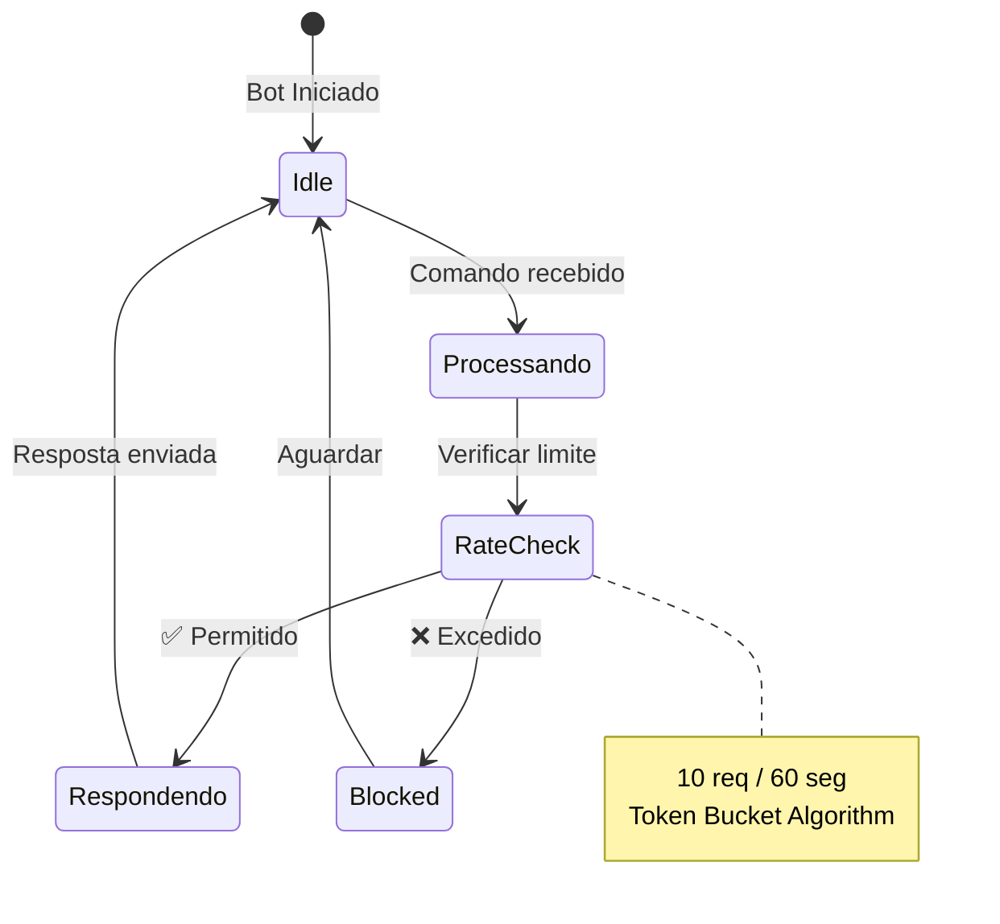
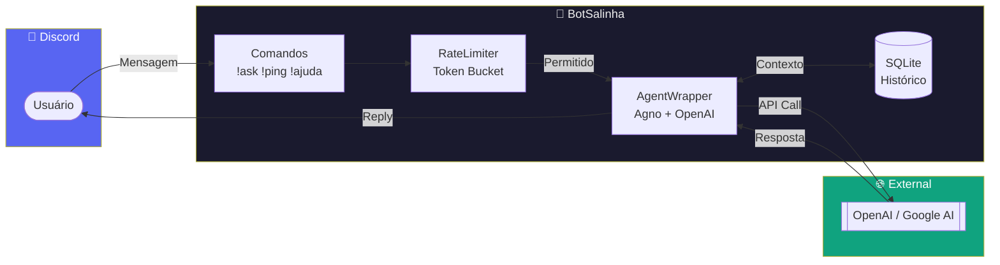
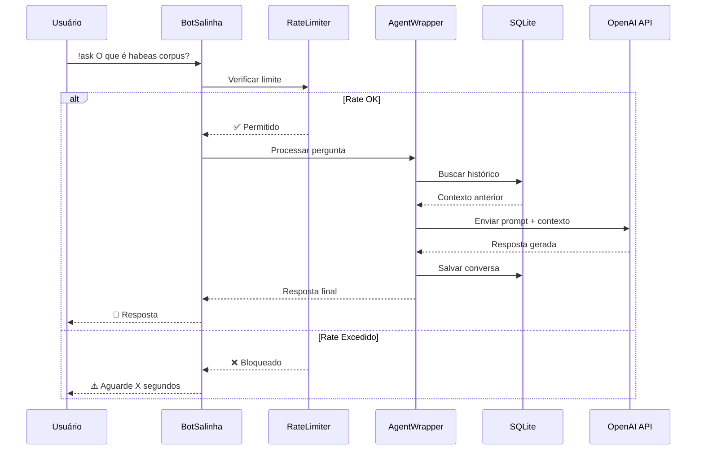
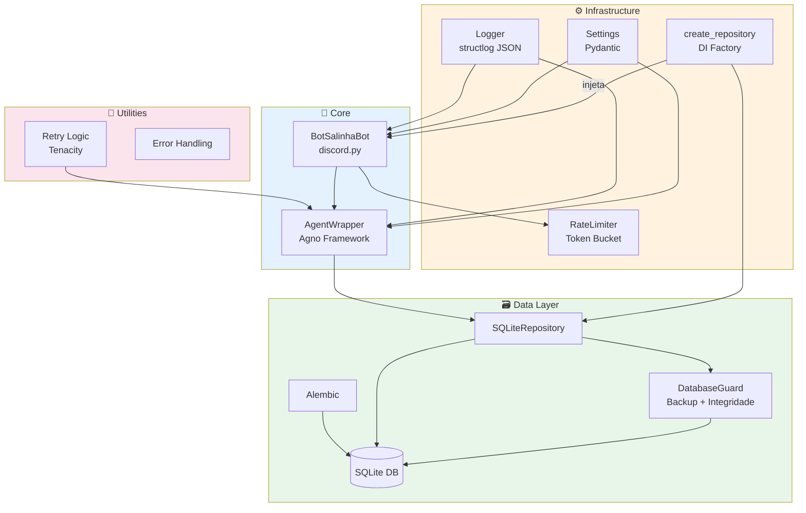
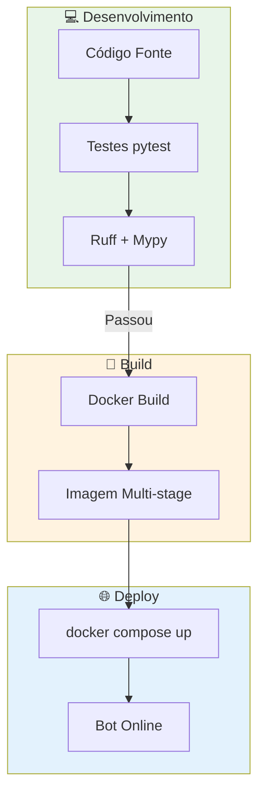

# 🤖 BotSalinha

<!-- markdownlint-disable MD033 -->
<div align="center">


<!-- markdownlint-enable MD033 -->

Bot do Discord especializado em direito brasileiro e concursos públicos

[](https://www.python.org/)
[](https://discordpy.readthedocs.io/)
[](LICENSE)
[](https://docs.astral.sh/ruff/)

[](https://github.com/astral-sh/uv)
[](https://pre-commit.com/)
[](.github/workflows/test.yml)

<!-- markdownlint-disable MD033 -->
</div>
<!-- markdownlint-enable MD033 -->

---

<!-- markdownlint-disable MD051 -->

## 🔎 Sumário

- [Sobre](#-sobre)
- [Início Rápido](#-início-rápido)
- [Comandos](#-comandos)
- [Configuração](#-configuração)
- [Arquitetura](#-arquitetura)
- [Desenvolvimento](#-desenvolvimento)
- [Implantação Docker](#-implantação-docker)
- [Solução de Problemas](#-solução-de-problemas)
- [Roadmap e Visão](#-roadmap-e-visão)
- [Funcionalidades (Features)](#-funcionalidades-features)
- [Contribuindo](#-contribuindo)
- [Documentação](#-documentação)
- [Licença](#-licença)

---

<!-- markdownlint-enable MD051 -->

## 📖 Sobre

<!-- markdownlint-disable MD013 -->

BotSalinha é um assistente inteligente para Discord que responde perguntas sobre **direito brasileiro**, **legislação**, **jurisprudência** e **preparação para concursos públicos**.

<!-- markdownlint-enable MD013 -->

### ✨ Destaques

<!-- markdownlint-disable MD013 -->

- 🧠 **IA Multi-Model**: Suporte a OpenAI e Google AI via framework Agno (OpenAI padrão)
<!-- markdownlint-enable MD013 -->
- 💬 **Conversas Contextuais**: Memória de até 3 pares de mensagens por conversa
- 🗃️ **Persistência SQLite exclusiva**: Banco SQLite validado no startup — sem suporte a outros backends
- 🛡️ **Rate Limiting**: Proteção contra abuso com algoritmo token bucket
- 🔄 **Resiliência**: Retentativa automática com backoff exponencial
- 📊 **Observabilidade**: Logs estruturados JSON com rastreamento de requisições
- 🐳 **DevOps Ready**: Dockerfile multi-stage e docker compose
- 🚀 **Três Modos de Interação**: Comandos prefixados, Canal IA dedicado e DMs automáticos
- 🔒 **Proteção do Banco**: Backup automático + verificação de integridade a cada inicialização
- 🔐 **RAG com Deduplicação**: Documentos indexados por SHA-256 — sem duplicatas acidentais

---

## 🚀 Início Rápido

### Pré-requisitos

<!-- markdownlint-disable MD013 -->

| Requisito         | Versão | Link                                                                    |
| ----------------- | ------ | ----------------------------------------------------------------------- |
| Python            | 3.12+  | [python.org](https://www.python.org/)                                   |
| uv                | latest | [astral.sh/uv](https://github.com/astral-sh/uv)                         |
| Discord Bot Token | -      | [Discord Developer Portal](https://discord.com/developers/applications) |
| OpenAI API Key    | -      | [OpenAI Platform](https://platform.openai.com/)                         |

<!-- markdownlint-enable MD013 -->

### Instalação

```bash
# 1. Clone o repositório
git clone https://github.com/prof-ramos/BotSalinha.git
cd BotSalinha

# 2. Instale as dependências com uv
uv sync

# 3. Configure as variáveis de ambiente
cp .env.example .env
```

Edite o arquivo `.env` com suas credenciais:

```env
DISCORD_BOT_TOKEN=seu_discord_bot_token_aqui
OPENAI_API_KEY=sua_openai_api_key_aqui
```

```bash
# 4. Execute o bot
uv run botsalinha run

# Veja a lista de comandos e opções completas
uv run botsalinha --help
```

---

## 💻 Comandos

### 🎮 Fluxo de Interação



### 📱 Três Modos de Interação

1. **Comandos com Prefixo (`!ask`, `!ping`, etc.)** - Modo tradicional
2. **Canal IA** - Modo automático de canal dedicado
3. **DM (Direct Message)** - Modo automático de mensagens privadas

**Modo Canal IA:**
Configure `DISCORD__CANAL_IA_ID` no `.env` para habilitar:

```env
DISCORD__CANAL_IA_ID=123456789012345678
```

Qualquer mensagem no canal configurada gera resposta automática.

**Modo DM:**
Qualquer mensagem direta para o bot gera resposta automática,
mantendo histórico isolado.

<!-- markdownlint-disable MD013 -->

| Comando           | Descrição                                    | Exemplo                                  |
| ----------------- | -------------------------------------------- | ---------------------------------------- |
| `!ask <pergunta>` | Faça uma pergunta sobre direito ou concursos | `!ask O que é habeas corpus?`            |
| `!buscar <termo>` | Busca vetorial no RAG por termo/tipo         | `!buscar "habeas corpus" jurisprudencia` |
| `!fontes`         | Lista os documentos indexados no RAG         | `!fontes`                                |
| `!reindexar`      | Recria o índice RAG (apenas admin)           | `!reindexar`                             |
| `!ping`           | Verifique a latência do bot                  | `!ping`                                  |
| `!ajuda`          | Mostra mensagem de ajuda                     | `!ajuda`                                 |
| `!info`           | Mostra informações do bot                    | `!info`                                  |
| `!limpar`         | Limpa o histórico da conversa                | `!limpar`                                |

Além dos comandos nativos do Discord, há uma interface iterativa rica por linha de comando (CLI) feita para desenvolvedores do bot (operações em banco, controle de sessões, prompts etc.).
Veja a [Referência Completa do CLI](docs/cli.md).

<!-- markdownlint-enable MD013 -->

---

## ⚙️ Configuração

A configuração usa duas fontes complementares:

- **`.env`**: Credenciais e segredos (tokens, API keys)
- **`config.yaml`**: Comportamento do agente (provider, modelo, prompt, temperatura)

### Variáveis Principais (`.env`)

<!-- markdownlint-disable MD013 -->

<!-- markdownlint-disable MD013 MD060 -->

| Variável                     | Padrão                         | Descrição                                  |
| ---------------------------- | ------------------------------ | ------------------------------------------ |
| `DISCORD_BOT_TOKEN`          | _obrigatório_                  | Token do bot Discord                       |
| `OPENAI_API_KEY`             | _obrigatório¹_                 | Chave da API OpenAI                        |
| `GOOGLE_API_KEY`             | _opcional²_                    | Chave da API Google AI                     |
| `HISTORY_RUNS`               | `3`                            | Pares de mensagens no histórico            |
| `RATE_LIMIT__REQUESTS`       | `10`                           | Máximo de requisições por janela           |
| `RATE_LIMIT__WINDOW_SECONDS` | `60`                           | Janela de tempo (segundos)                 |
| `DATABASE__URL`              | `sqlite:///data/botsalinha.db` | URL de conexão do banco (formato aninhado) |
| `LOG_LEVEL`                  | `INFO`                         | Nível de log (DEBUG, INFO, WARNING, ERROR) |

¹ Obrigatório quando `model.provider` = `openai` (padrão). ² Obrigatório quando `model.provider` = `google`.

### Configuração do Canal IA

Opcionalmente, configure um canal dedicado para interação automática:

```env
# ID do canal dedicado para interação com IA (opcional)
# Encontre o ID: clique com botão direito no canal → Copiar ID do Canal
DISCORD__CANAL_IA_ID=123456789012345678
```

> **Nota:** O projeto suporta formatos flat (`DATABASE_URL`) e aninhado (`DATABASE__URL`). O formato aninhado tem prioridade.

<!-- markdownlint-enable MD013 MD060 -->

### Troca de Provider (OpenAI ↔ Google)

Edite `config.yaml` para trocar o provider ativo:

```yaml
# OpenAI (padrão):
model:
  provider: openai
  id: gpt-4o-mini

# Google AI:
model:
  provider: google
  id: gemini-2.0-flash
```

<!-- markdownlint-disable MD013 -->

> ⚠️ O provider é definido **exclusivamente** no `config.yaml`, nunca por variável de ambiente.
>
> 📄 Veja [`.env.example`](.env.example) e [`config.yaml.example`](config.yaml.example) para detalhes.

<!-- markdownlint-enable MD013 -->

---

## 🏗️ Arquitetura

BotSalinha segue uma arquitetura modular com separação clara de responsabilidades:



### 🔄 Fluxo de Requisição



### 📦 Componentes



> 📋 **Padrão DI:** `BotSalinhaBot` requer o repositório como parâmetro obrigatório.
> A factory `create_repository()` (em `src/storage/factory.py`) é o único ponto de criação.
> Veja [docs/architecture.md](docs/architecture.md) para detalhes.

### Componentes

<!-- markdownlint-disable MD060 -->

| Componente             | Tecnologia           | Descrição              |
| ---------------------- | -------------------- | ---------------------- |
| **Integração Discord** | `discord.py`         | Framework de comandos  |
| **Limitação de Taxa**  | Token Bucket         | Algoritmo em memória   |
| **Agente IA**          | Agno + OpenAI/Google | Contexto de conversa   |
| **Persistência**       | SQLAlchemy + SQLite  | ORM com backend SQLite |
| **Logging**            | structlog            | Logs estruturados JSON |

<!-- markdownlint-enable MD060 -->

### Estrutura do Projeto

```text
botsalinha/
├── bot.py                 # Ponto de entrada
├── src/
│   ├── config/            # Configurações Pydantic (Settings + YAML)
│   ├── core/              # Wrappers do bot, agente e lifecycle
│   ├── models/            # Modelos de dados (ORM + Pydantic)
│   ├── storage/           # Repositório SQLite + Factory DI + DatabaseGuard
│   ├── rag/               # Pipeline RAG (parser, embedding, query, deduplicação)
│   ├── tools/             # Gerenciador MCP
│   ├── utils/             # Logs, erros, retry
│   └── middleware/        # Rate limiting
├── tests/                 # Testes pytest (unit / integration / e2e)
├── migrations/            # Migrações Alembic
├── scripts/               # Utilitários de backup
├── docs/                  # Documentação
├── prompt/                # Prompts do sistema (v1/v2/v3)
└── data/                  # Banco SQLite + backups automáticos (gitignore)
```

---

## 🔧 Desenvolvimento

### Executar Testes

```bash
# Executar todos os testes com cobertura
uv run pytest

# Executar com verbose
uv run pytest -v

# Executar arquivo específico
uv run pytest tests/test_settings.py
```

### Qualidade do Código

```bash
# Linting
uv run ruff check src/

# Formatação
uv run ruff format src/

# Verificação de tipos
uv run mypy src/

# Executar todas as verificações
uv run ruff check src/ && uv run ruff format src/ && uv run mypy src/
```

### Migrações do Banco de Dados

```bash
# Criar nova migração
uv run alembic revision --autogenerate -m "descrição da mudança"

# Aplicar migrações
uv run alembic upgrade head

# Reverter última migração
uv run alembic downgrade -1
```

### Backup e Restore

```bash
# Criar backup
uv run python scripts/backup.py backup

# Listar backups
uv run python scripts/backup.py list

# Restaurar do backup
uv run python scripts/backup.py restore --restore-from backups/arquivo.db
```

---

## 🐳 Implantação Docker

### 🚀 Pipeline de Deploy



### Desenvolvimento

```bash
docker compose up -d
```

### Produção

```bash
docker compose -f docker-compose.prod.yml up -d
```

> 📖 Veja [docs/deployment.md](docs/deployment.md) para instruções detalhadas.

---

## 🐛 Solução de Problemas

### O bot não responde aos comandos

<!-- markdownlint-disable MD013 -->

1. ✅ Verifique se **MESSAGE_CONTENT Intent** está habilitado no [Discord Developer Portal](https://discord.com/developers/applications)
2. ✅ Confirme que o bot tem as permissões necessárias (`Send Messages`, `Read Message History`)
3. ✅ Certifique-se de que o bot está online no seu servidor
<!-- markdownlint-enable MD013 -->

### Erros de banco de dados

```bash
# Verifique se o diretório existe
mkdir -p data/

# Aplique migrações
uv run alembic upgrade head
```

### Problemas de limitação de taxa

Ajuste as configurações no `.env`:

```env
RATE_LIMIT_REQUESTS=20
RATE_LIMIT_WINDOW_SECONDS=60
```

### Banco de dados corrompido ou travado

```bash
# Verificar integridade manualmente
sqlite3 data/botsalinha.db "PRAGMA integrity_check;"

# Restaurar a partir de backup automático
uv run python scripts/backup.py list
uv run python scripts/backup.py restore --restore-from data/backups/botsalinha_auto_<data>.db
```

> O `DatabaseGuard` cria um backup automático a cada inicialização do bot em `data/backups/`,
> mantendo os 5 mais recentes.

### Tentando usar URL de banco PostgreSQL ou outro

O BotSalinha aceita **apenas SQLite**. Se você configurar um `DATABASE_URL` com outro driver,
a aplicação encerrará com `ConfigurationError` no startup. Use o formato:

```env
DATABASE__URL=sqlite:///data/botsalinha.db
```

---

## 🗺️ Roadmap e Visão

O desenvolvimento é guiado pelas prioridades definidas em [ROADMAP.md](ROADMAP.md).

Para uma visão detalhada das capacidades já implementadas e em desenvolvimento,
veja **[FEATURES.md](FEATURES.md)**.

---

## 🔭 Funcionalidades (Features)

Para um inventário detalhado de capacidades (Estável vs Beta vs Planejado),
consulte **[FEATURES.md](FEATURES.md)**.

### Próximas Features (Breve)

- [x] **RAG Integrado**: Busca em documentos jurídicos.
- [x] **Citação de Fontes**: Referência automática a leis e processos.
- [ ] **Dashboard**: Interface de analytics para gestores de comunidade.

---

---

## 🤝 Contribuindo

Contribuições são bem-vindas! Por favor, siga estas etapas:

1. **Fork** o repositório
2. **Crie** uma branch para sua feature (`git checkout -b feature/nova-funcionalidade`)
3. **Faça** commit das suas mudanças (`git commit -m 'feat: adiciona nova funcionalidade'`)
4. **Push** para a branch (`git push origin feature/nova-funcionalidade`)
5. **Abra** um Pull Request

### Padrões de Commit

Este projeto segue [Conventional Commits](https://www.conventionalcommits.org/):

- `feat:` - Nova funcionalidade
- `fix:` - Correção de bug
- `docs:` - Documentação
- `style:` - Formatação
- `refactor:` - Refatoração
- `test:` - Testes
- `chore:` - Tarefas de manutenção

---

## 📚 Documentação

<!-- markdownlint-disable MD013 -->

<!-- markdownlint-disable MD060 MD013 -->

| Documento                                                                            | Descrição                          |
| ------------------------------------------------------------------------------------ | ---------------------------------- |
| [docs/README.md](docs/README.md)                                                     | Índice da documentação             |
| [docs/architecture.md](docs/architecture.md)                                         | Visão geral da arquitetura         |
| [PRD.md](PRD.md)                                                                     | Documento de Requisitos do Produto |
| [docs/api.md](docs/api.md)                                                           | Referência de comandos Discord     |
| [docs/cli.md](docs/cli.md)                                                           | Interface CLI de Operações         |
| [docs/deployment.md](docs/deployment.md)                                             | Guia de Implantação                |
| [docs/operations.md](docs/operations.md)                                             | Manual de Operações                |
| [docs/DEVELOPER_GUIDE.md](docs/DEVELOPER_GUIDE.md)                                   | Guia do Desenvolvedor              |
| [docs/adr/ADR-001-multi-model-provider.md](docs/adr/ADR-001-multi-model-provider.md) | Decisão arquitetural principal     |
| [CHANGELOG.md](CHANGELOG.md)                                                         | Histórico de mudanças              |
| [llms.txt](llms.txt)                                                                 | Guia AI-friendly do projeto        |

<!-- markdownlint-enable MD013 -->

---

## 📄 Licença

<!-- markdownlint-disable MD013 -->

Este projeto está licenciado sob a **MIT License** - veja o arquivo [LICENSE](LICENSE) para detalhes.

<!-- markdownlint-enable MD013 -->

---

## 📞 Suporte

Encontrou um problema? Tem uma sugestão?

- 🐛 **Bugs**: [Abra uma issue](https://github.com/prof-ramos/BotSalinha/issues)
- 💡 **Sugestões**: [Discussions](https://github.com/prof-ramos/BotSalinha/discussions)
- 📧 **Contato**: Via GitHub

---

<!-- markdownlint-disable MD033 -->
<div align="center">
<!-- markdownlint-enable MD033 -->

**Desenvolvido com ❤️ por [Prof. Ramos](https://instagram.com/prof.gabrielramos)**

[](https://instagram.com/prof.gabrielramos)

[⬆️ Voltar ao topo](#-botsalinha)

<!-- markdownlint-disable MD033 -->
</div>
<!-- markdownlint-enable MD033 -->
