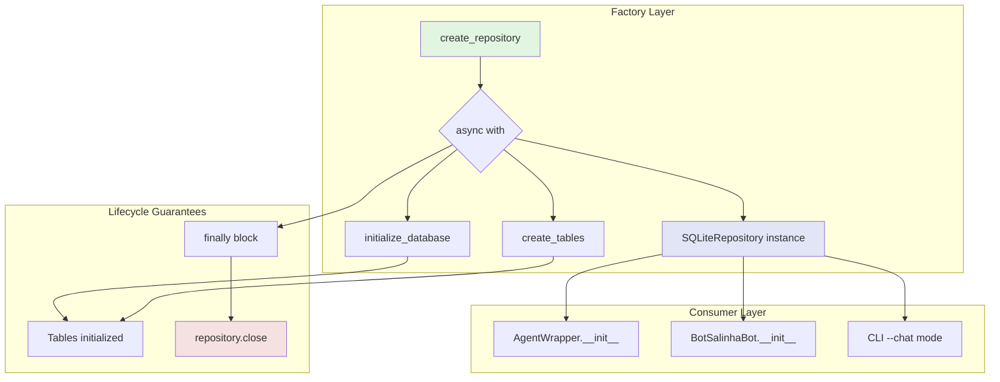
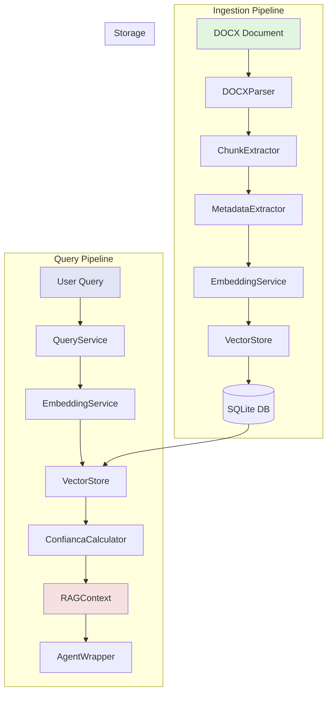
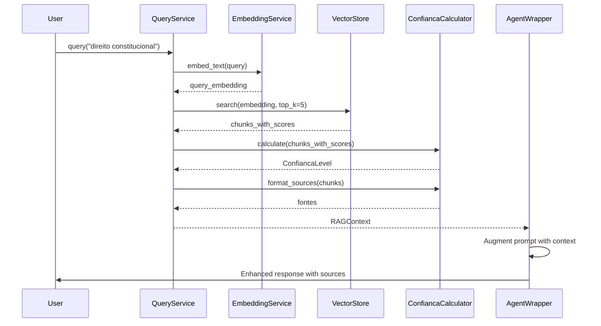

# Architecture Overview

This document serves as a critical, living template designed to equip agents with a rapid and comprehensive understanding of the codebase's architecture, enabling efficient navigation and effective contribution from day one. Update this document as the codebase evolves.

## 1. Project Structure

This section provides a high-level overview of the project's directory and file structure, categorised by architectural layer or major functional area. It is essential for quickly navigating the codebase, locating relevant files, and understanding the overall organization and separation of concerns.

```text
[BotSalinha]/
├── src/                    # Main source code for backend services
│   ├── config/             # Configuration management (Pydantic settings, YAML loader)
│   ├── core/               # Central business logic (AgentWrapper, Bot Lifecycle)
│   ├── middleware/         # Request interceptors (Rate Limiter)
│   ├── models/             # Database ORM models (Conversations, Messages, RAG)
│   │   ├── conversation.py     # Conversation ORM and Pydantic schemas
│   │   ├── message.py          # Message ORM and Pydantic schemas
│   │   └── rag_models.py       # RAG ORM models (DocumentORM, ChunkORM)
│   ├── rag/                # RAG (Retrieval-Augmented Generation) module
│   │   ├── models.py           # RAG Pydantic models (Chunk, Document, RAGContext)
│   │   ├── config.py           # RAG configuration
│   │   ├── parser/             # Document parsing
│   │   │   ├── docx_parser.py  # DOCX document parser
│   │   │   └── chunker.py      # Chunk extractor with hierarchical context
│   │   ├── services/           # RAG services
│   │   │   ├── embedding_service.py  # OpenAI embeddings
│   │   │   ├── ingestion_service.py  # Document ingestion pipeline
│   │   │   └── query_service.py      # Semantic search orchestration
│   │   ├── storage/            # RAG storage
│   │   │   ├── vector_store.py     # Vector similarity search
│   │   │   └── rag_repository.py   # RAG repository interface
│   │   └── utils/              # RAG utilities
│   │       ├── confianca_calculator.py  # Confidence level calculator
│   │       └── metadata_extractor.py    # Legal document metadata extraction
│   ├── storage/            # Data access layer (SQLite Repository + Factory)
│   │   ├── repository.py       # Abstract repository interfaces
│   │   ├── factory.py          # Dependency injection factory (create_repository)
│   │   └── sqlite_repository.py# SQLite implementation
│   └── utils/              # General utility functions (Errors, Retry logic)
├── tests/                  # Backend unit and integration tests (pytest)
│   ├── e2e/                # End-to-end command tests
│   │   ├── test_rag_search.py # E2E RAG search tests
│   │   └── ...
│   ├── fixtures/           # Mock data and Discord bot wrappers for tests
│   ├── integration/        # Integration tests
│   │   └── rag/                # RAG integration tests
│   │       └── test_recall.py  # Recall metric tests
│   └── unit/               # Isolated unit tests
│       └── rag/                # RAG unit tests
│           ├── test_confianca_calculator.py
│           └── test_vector_store.py
├── docs/                   # Project documentation (e.g., API docs, setup guides)
│   └── plans/              # Implementation plans
│       ├── RAGV1.md            # RAG v1 implementation plan
│       └── RAG/                # RAG documentation and decisions
│           ├── README.md
│           ├── decisoes_arquiteturais.md
│           └── melhorias_sugeridas.md
├── scripts/                # Automation scripts (Database backup/restore)
├── migrations/             # Database schema migrations (Alembic)
│   └── versions/
│       ├── 001_initial.py
│       ├── 002_rename_metadata_to_meta_data.py
│       ├── 20260228_0236_203b07bc02cc_add_rag_documents_and_chunks_tables.py
│       ├── 20260228_1000_add_embedding_column_to_rag_chunks.py
│       └── 20260228_1100_add_file_hash_to_rag_documents.py
├── data/                   # Persistent storage for SQLite database (git-ignored)
│   └── documents/          # RAG documents directory
├── bot.py                  # Main entry point of the application
├── pyproject.toml          # Python dependencies and project metadata (uv)
├── docker-compose.yml      # Docker configuration for local development
├── docker-compose.prod.yml # Docker configuration for production deployment
├── config.yaml.example     # Template for agent behavior configuration
├── .env.example            # Template for environment variables (secrets)
├── README.md               # Project overview and quick start guide
└── docs/architecture.md    # This document
```

## 2. High-Level System Diagram

The BotSalinha is stateless at the instance level (no in-memory sessions are kept between requests) but stateful via its database — conversation history is persisted in a local SQLite database to preserve context across messages. This design means that scaling to multiple replicas would require migrating from SQLite to a centralized database (e.g., PostgreSQL).

### 2.1. Core System Flow (without RAG)

```text
[Discord User] <--> [BotSalinha Application] <--> [SQLite Database]
                               |
                               +--> [AI Provider API (OpenAI / Google)]
```

### 2.2. RAG-Enhanced System Flow

When RAG is enabled, the system augments user queries with relevant legal context before sending to the AI provider:

```text
[Discord User]
      |
      v
[BotSalinha Application]
      |
      +--> [QueryService] --> [EmbeddingService] --> [VectorStore]
      |         |                                            |
      |         v                                            v
      |    [ConfiancaCalculator] <---- [SQLite Database (RAG Tables)]
      |         |
      v         v
[AgentWrapper with RAG Context]
      |
      +--> [AI Provider API (OpenAI / Google)]
      |
      v
[Enhanced Response with Sources]
```

## 3. Core Components

### 3.1. Frontend

Name: Discord Client (Native)

Description: The main user interface for interacting with the system, allowing users to interact with the bot in server channels or via Direct Messages using predefined commands like `!ask`.

Technologies: Discord API (managed via `discord.py`)

Deployment: N/A (Discord Ecosystem)

### 3.2. Backend Services

#### 3.2.1. Bot Application Core

Name: BotSalinha Discord Application

Description: The central application that connects to the Discord websocket gateway, listens to application commands, manages rate limits, and orchestrates calls to the AI models. Includes smart message splitting logic to handle Discord's 2000 character limit semantically, respecting paragraphs.

Technologies: Python 3.12+, `discord.py`

Deployment: Docker Container via `docker-compose`

#### 3.2.2. AI Agent Engine

Name: AgentWrapper (Agno)

Description: Wraps the Agno framework to handle contextual conversation generation. It fetches previous messages from the database, builds a prompt (with dynamic token-budget truncation using `max_tokens` to prevent context overflow), and streams requests to the active AI provider. Uses **Dependency Injection** for repository management (repository injected via constructor, NOT singleton pattern).

Technologies: Agno Framework, OpenAI Python SDK, Google GenAI SDK

Deployment: Embedded within the Bot Application Core

Key Design Patterns:
- Constructor injection via `src/storage/factory.py::create_repository()`
- Async context manager for automatic resource cleanup

**Dependency Injection Flow:**



**Key Guarantees:**
1. `create_repository()` guarantees `initialize_database()` and `create_tables()` on entry
2. `async with` block guarantees `close()` in finally block (even on exceptions)
3. No manual cleanup required - context manager handles lifecycle

#### 3.2.3. Repository Lifecycle Guarantees

**Factory Pattern:** `create_repository()` is an async context manager with strict lifecycle guarantees:

### On Entry (__aenter__)
1. ✅ Calls `initialize_database()` - ensures DB file exists
2. ✅ Calls `create_tables()` - ensures schema is up-to-date
3. ✅ Returns initialized `SQLiteRepository` instance

### On Exit (__aexit__)
1. ✅ ALWAYS calls `repository.close()` in finally block
2. ✅ Handles exceptions gracefully (logs before cleanup)
3. ✅ No manual cleanup required by consumers

### Example Usage
```python
from src.storage.factory import create_repository

async with create_repository() as repo:
    # DB is initialized and ready
    await repo.create_conversation(...)
    # Auto-cleanup guaranteed on exit
```

**Safety Guarantees:**
- No orphaned database connections
- No uninitialized table errors
- Exception-safe cleanup
- No manual `repo.close()` needed

### 3.4. RAG Pipeline (Retrieval-Augmented Generation)

Name: RAG System

Description: A complete Retrieval-Augmented Generation pipeline that enhances AI responses with relevant legal context from indexed documents. The system parses DOCX documents (Constitution, Laws), chunks them with hierarchical metadata, generates embeddings via OpenAI, and provides semantic search capabilities.

Technologies: Python 3.12+, OpenAI Embeddings API, NumPy (cosine similarity), SQLite

Deployment: Embedded within the Bot Application Core

#### 3.4.1. RAG Architecture Overview



#### 3.4.2. Ingestion Pipeline

The ingestion pipeline processes legal documents (DOCX format) into searchable chunks:

```mermaid
flowchart LR
    subgraph "Parse Stage"
        A[DOCX File] --> B[DOCXParser]
        B --> C[Parsed Document<br/>paragraphs, styles]
    end

    subgraph "Chunk Stage"
        C --> D[ChunkExtractor]
        D --> E[Raw Chunks<br/>with hierarchy]
    end

    subgraph "Metadata Stage"
        E --> F[MetadataExtractor]
        F --> G[Enriched Chunks<br/>artigo, inciso, etc.]
    end

    subgraph "Embed Stage"
        G --> H[EmbeddingService]
        H --> I[Chunks with<br/>embeddings]
    end

    subgraph "Store Stage"
        I --> J[VectorStore]
        J --> K[(rag_chunks table)]
    end

    style A fill:#e1f5e1
    style K fill:#f5e1e1
```



**Key Components:**

| Component | File | Purpose |
|-----------|------|---------|
| `DOCXParser` | `src/rag/parser/docx_parser.py` | Parse DOCX documents preserving structure and styles |
| `ChunkExtractor` | `src/rag/parser/chunker.py` | Extract chunks with hierarchical context (titulo, capitulo, artigo) |
| `MetadataExtractor` | `src/rag/utils/metadata_extractor.py` | Extract legal metadata (artigo, inciso, paragrafo, marcas) |
| `EmbeddingService` | `src/rag/services/embedding_service.py` | Generate embeddings via OpenAI API (text-embedding-3-small) |
| `IngestionService` | `src/rag/services/ingestion_service.py` | Orchestrate complete ingestion pipeline |

#### 3.4.3. Query Pipeline

The query pipeline retrieves relevant context for user questions:



#### 3.4.4. Confidence Level System

The system calculates confidence based on average similarity of retrieved chunks:

| Level | Threshold | Message | Behavior |
|-------|-----------|---------|----------|
| **ALTA** | ≥ 0.85 | ✅ "Resposta baseada em documentos jurídicos indexados" | Full RAG augmentation |
| **MEDIA** | ≥ 0.70 | ⚠️ "Resposta parcialmente baseada em documentos" | RAG augmentation with verification note |
| **BAIXA** | ≥ 0.60 | ❌ "Informações limitadas encontradas" | RAG augmentation with low confidence warning |
| **SEM_RAG** | < 0.60 | ℹ️ "Não encontrei informações específicas" | No RAG augmentation, general knowledge |

**Confidence Calculator Logic:**

```python
# From src/rag/utils/confianca_calculator.py
class ConfiancaCalculator:
    ALTA_THRESHOLD = 0.85   # High confidence
    MEDIA_THRESHOLD = 0.70  # Medium confidence
    BAIXA_THRESHOLD = 0.60  # Low confidence

    def calculate(self, chunks_with_scores) -> ConfiancaLevel:
        avg_similarity = sum(score for _, score in chunks_with_scores) / len(chunks_with_scores)
        # Returns appropriate ConfiancaLevel based on thresholds
```

#### 3.4.5. RAG Data Models

**Pydantic Models** (`src/rag/models.py`):

```python
class ChunkMetadata(BaseModel):
    """Metadata for a document chunk."""
    documento: str           # Document identifier (e.g., 'CF/88')
    titulo: str | None       # Section title
    capitulo: str | None     # Chapter reference
    secao: str | None        # Section reference
    artigo: str | None       # Article number
    paragrafo: str | None    # Paragraph number
    inciso: str | None       # Inciso/Item number
    tipo: str | None         # Type (caput, inciso, etc.)
    marca_atencao: bool      # Important attention point
    marca_stf: bool          # STF relevant
    marca_stj: bool          # STJ relevant
    marca_concurso: bool     # Concurso relevant
    banca: str | None        # Exam board name
    ano: str | None          # Exam year

class ConfiancaLevel(StrEnum):
    """Confidence level for RAG retrieval."""
    ALTA = "alta"
    MEDIA = "media"
    BAIXA = "baixa"
    SEM_RAG = "sem_rag"

class RAGContext(BaseModel):
    """Context retrieved from RAG for query augmentation."""
    chunks_usados: list[Chunk]
    similaridades: list[float]
    confianca: ConfiancaLevel
    fontes: list[str]
```

#### 3.4.6. RAG Configuration

```python
# From src/config/settings.py
class RAGConfig(BaseSettings):
    enabled: bool = True                    # Enable RAG functionality
    top_k: int = 5                          # Number of chunks to retrieve
    min_similarity: float = 0.6             # Minimum similarity threshold
    max_context_tokens: int = 2000          # Maximum context tokens
    documents_path: str = "data/documents"  # Path to documents directory
    embedding_model: str = "text-embedding-3-small"  # OpenAI embedding model
    confidence_threshold: float = 0.70      # Confidence threshold
```

**Environment Variables:**
```bash
RAG__ENABLED=true
RAG__TOP_K=5
RAG__MIN_SIMILARITY=0.6
RAG__MAX_CONTEXT_TOKENS=2000
RAG__DOCUMENTS_PATH=data/documents
RAG__EMBEDDING_MODEL=text-embedding-3-small
RAG__CONFIDENCE_THRESHOLD=0.70
```

## 3.5. Hybrid Pattern State (Transitional Architecture)

**Status:** Transitional (Target: Full DI by v2.1 - Q2 2026)

The codebase currently uses a **hybrid approach** during migration from Singleton to Dependency Injection:

### Current State (February 2026)

| Component | Pattern Used | Notes |
|-----------|--------------|-------|
| CLI mode (`--chat`) | `create_repository()` | ✅ Full DI (new code) |
| `AgentWrapper` | Constructor injection | ✅ Full DI (refactored) |
| `BotSalinhaBot.__init__()` | Fallback to `get_repository()` | ⚠️ Hybrid (uses singleton if no repo injected) |
| Lifecycle code (`lifecycle.py`) | `get_repository()` direct | ⚠️ Legacy singleton |
| Operations/Scripts | Mixed | ⚠️ Some updated, some legacy |

### Migration Timeline

- **v2.0 (Current):** Hybrid state - both patterns coexist
- **v2.1 (Q2 2026 - Tentative):** Remove `get_repository()` entirely
- **Deprecation Notice:** `get_repository()` is deprecated and will be removed in v2.1

### For Developers

**When adding new code:**
- ✅ ALWAYS use `create_repository()` with `async with`
- ❌ NEVER use `get_repository()` in new code
- ⚠️ When modifying legacy code, consider migrating to DI pattern

**Example (New Code Pattern):**
```python
from src.storage.factory import create_repository

async with create_repository() as repo:
    # Use repo
    pass  # Auto-cleanup on exit
```

**Example (Legacy Pattern - DO NOT USE in new code):**
```python
from src.storage.sqlite_repository import get_repository

repo = get_repository()  # ❌ Deprecated
# Manual cleanup required
```

## 4. Data Stores

### 4.1. Primary User Database

Name: Primary SQLite Database

Type: SQLite (`data/botsalinha.db`) enabled with WAL mode and managed by a `StaticPool` in SQLAlchemy.

Purpose: Stores user conversation history to maintain context across multiple interactions, and persists application metadata. Optimized to avoid N+1 query patterns.

Key Schemas/Collections: `conversations`, `messages`, `rag_documents`, `rag_chunks`

### 4.2. RAG Tables

#### 4.2.1. rag_documents

Stores metadata about indexed documents:

| Column | Type | Description |
|--------|------|-------------|
| `id` | INTEGER PK | Auto-increment primary key |
| `nome` | VARCHAR(255) | Document name (e.g., 'CF/88', 'Lei 8.112/90') |
| `arquivo_origem` | VARCHAR(500) | Source file path |
| `chunk_count` | INTEGER | Number of chunks generated |
| `token_count` | INTEGER | Total token count |
| `file_hash` | VARCHAR(64) UNIQUE | SHA-256 hex digest for deduplication (nullable for legacy rows) |
| `created_at` | DATETIME | Document ingestion timestamp |

**Relationships:**
- One-to-many with `rag_chunks` (cascade delete)

#### 4.2.2. rag_chunks

Stores document chunks with embeddings:

| Column | Type | Description |
|--------|------|-------------|
| `id` | VARCHAR(255) PK | Unique chunk identifier (UUID) |
| `documento_id` | INTEGER FK | Reference to `rag_documents.id` |
| `texto` | TEXT | Chunk text content |
| `metadados` | TEXT | JSON string with ChunkMetadata |
| `token_count` | INTEGER | Estimated token count |
| `embedding` | BLOB | Serialized embedding (float32 array) |
| `created_at` | DATETIME | Chunk creation timestamp |

**Embedding Storage:**
- Embeddings are stored as BLOB (LargeBinary)
- Format: Serialized float32 array (1536 dimensions for text-embedding-3-small)
- Conversion handled by `VectorStore._serialize_embedding()` and `_deserialize_embedding()`

**Indexes:**
- `documento_id` (foreign key index)
- Primary key on `id`

### 4.3. In-Memory Caches

Name: Rate Limiter State

Type: In-Memory / Python Dictionary

Purpose: An in-memory Token Bucket implementation (free of global concurrency locks due to `asyncio`'s single-threaded model) to enforce rate limits per user/guild and prevent API abuse.

Name: Local Conversation Cache

Type: In-Memory (`cachetools.TTLCache`)

Purpose: Reduces redundant database read calls during frequent interactions (e.g., `!ask`) by storing references to recent conversations per user and server.

## 5. External Integrations / APIs

Service Name 1: Discord API

Purpose: Receiving command events and sending text responses back to Discord channels/users.

Integration Method: WebSocket / REST via `discord.py`

Service Name 2: OpenAI API (Default)

Purpose: The primary Large Language Model (LLM) engine responsible for generating responses to legal and general questions.

Integration Method: REST via Agno / OpenAI Python SDK

Service Name 3: Google AI / Gemini API (Optional)

Purpose: Alternative Large Language Model engine.

Integration Method: REST via Agno / Google GenAI SDK

Service Name 4: OpenAI Embeddings API

Purpose: Generate vector embeddings for semantic similarity search in RAG pipeline. Uses `text-embedding-3-small` model (1536 dimensions).

Integration Method: REST via OpenAI Python SDK (`src/rag/services/embedding_service.py`)

**Key Features:**
- Batch embedding support for efficient ingestion
- Automatic retry on API failures
- Configurable embedding model via `RAG__EMBEDDING_MODEL`

**API Usage:**
```python
# From src/rag/services/embedding_service.py
class EmbeddingService:
    async def embed_text(self, text: str) -> list[float]:
        """Generate embedding for a single text."""
        
    async def embed_batch(self, texts: list[str]) -> list[list[float]]:
        """Generate embeddings for multiple texts (efficient batch API)."""
```

## 6. Deployment & Infrastructure

Cloud Provider: Agnostic (VPS, AWS EC2, DigitalOcean Droplet)

Key Services Used: Docker Engine

CI/CD Pipeline: GitHub Actions (Testing) / Manual Deployment via Docker Compose

Monitoring & Logging: `structlog` (Structured JSON logs to stdout)

## 7. Security Considerations

Authentication: Discord Bot Token via `.env`, AI Provider API Keys (OpenAI / Google) via `.env`

Authorization: Native Discord permissions (MESSAGE_CONTENT intent required).

Data Encryption:

- **In Transit:** TLS for all external API calls (Discord, OpenAI, Google).
- **At Rest:** The SQLite database is **not encrypted at rest**. Conversation history may contain Personally Identifiable Information (PII). For environments subject to GDPR/LGPD compliance, consider migrating to **SQLCipher** (transparent SQLite encryption) or implementing application-level encryption before persisting data.

Key Security Tools/Practices: Environment variables for secrets, strict validation via `pydantic` for configuration, rate limiting to prevent Denial of Wallet attacks on the AI API, **prompt length validation** (10,000 character limit enforced at Discord layer to prevent token overflow attacks).

**Note:** Prompt validation is Discord-specific (in `discord.py` command handlers). The `AgentWrapper` itself does NOT validate - validation happens BEFORE calling the agent layer.

**RAG-Specific Security:**
- Embeddings stored locally (no external vector database)
- Document ingestion requires local file access
- No user-uploaded documents (admin-controlled ingestion)

## 8. Development & Testing Environment

Local Setup Instructions: Use `uv` for dependency management. Create an `.env` file from `.env.example`, and a `config.yaml` from `config.yaml.example`. Run `uv sync` and `uv run bot.py`.

Testing Frameworks: `pytest` (with `pytest-asyncio` and `pytest-mock`), E2E tests simulating external APIs.

Factory Tests: Unit tests for `create_repository()` async context manager lifecycle (initialization, cleanup, exception handling) in `tests/unit/test_factory.py`.

Code Quality Tools: `ruff` (linter and formatter), `mypy` (type checker).

### RAG Testing

**Test Files:**
- `tests/e2e/test_rag_search.py` - End-to-end RAG search tests
- `tests/unit/rag/test_confianca_calculator.py` - Confidence calculation tests
- `tests/unit/rag/test_vector_store.py` - Vector store operations tests
- `tests/integration/rag/test_recall.py` - Recall metric integration tests

**Test Coverage:** RAG modules must maintain minimum 70% coverage (project standard).

### Configuration: BaseSettings Nested Pattern

**Pydantic Settings supports TWO formats for environment variables:**

#### Flat Format (Legacy)
```bash
DATABASE_URL=sqlite:///data/botsalinha.db
OPENAI_API_KEY=sk-...
```

#### Nested Format (Preferred - has priority)
```bash
DATABASE__URL=sqlite:///data/botsalinha.db  # Note: double underscore
OPENAI__API_KEY=sk-...                        # Note: double underscore
```

**Priority Rule:** If BOTH formats are present, nested (`__`) takes precedence over flat.

#### Implementation
```python
from pydantic_settings import BaseSettings, SettingsConfigDict

class DatabaseConfig(BaseSettings):
    model_config = SettingsConfigDict(
        env_prefix='DATABASE__',  # Double underscore = nested delimiter
        env_file='.env'
    )

    url: str = 'sqlite:///data/botsalinha.db'

# Reads from DATABASE__URL (nested) or DATABASE_URL (flat as fallback)
# Nested has PRIORITY over flat
```

**Why Nested Format?**
- Clear namespace separation (DATABASE__ vs OPENAI__)
- Avoids name collisions between config sections
- Easier to document with nested structures
- Aligns with Pydantic best practices

**Migration Note:** New code should use nested format (`__`), but flat format remains supported for backward compatibility.

## 9. Future Considerations / Roadmap

### Completed ✅

- **RAG Implementation (v2.0):** Complete RAG pipeline with DOCX parsing, semantic search, and confidence levels.

### Planned Improvements

- **PDF Support:** Extend `DOCXParser` to support PDF documents (PyMuPDF or pdfplumber)
- **Dedicated Vector Database:** Migrate from SQLite BLOB storage to dedicated vector database (ChromaDB, Qdrant, or pgvector) for better scalability
- **Multi-language Support:** Implement native multi-language support
- **Web Dashboard:** Create a web dashboard for analytics visualization or conversation management
- **LGPD Compliance:** Implement data anonymization and user data export/deletion endpoints
- **Re-ranking:** Add cross-encoder re-ranking for improved retrieval quality
- **Hybrid Search:** Combine semantic search with keyword (BM25) search for better recall

## 10. Project Identification

Project Name: BotSalinha

Repository URL: <https://github.com/prof-ramos/BotSalinha>

Primary Contact/Team: Prof. Ramos

Date of Last Update: 2026-02-28

## 11. Glossary / Acronyms

[Agno]: An open-source Python framework for building autonomous agents.

[Chunk]: A segment of text from a document, used for semantic search in RAG.

[Confidence Level]: A measure (ALTA/MEDIA/BAIXA/SEM_RAG) indicating the reliability of RAG retrieval results.

[E2E]: End-to-End Testing.

[Embedding]: A vector representation of text used for semantic similarity comparison.

[LLM]: Large Language Model (e.g., GPT-4o, Gemini).

[RAG]: Retrieval-Augmented Generation - enhancing LLM responses with relevant context retrieved from a knowledge base.

[Vector Store]: A storage system optimized for vector similarity search.