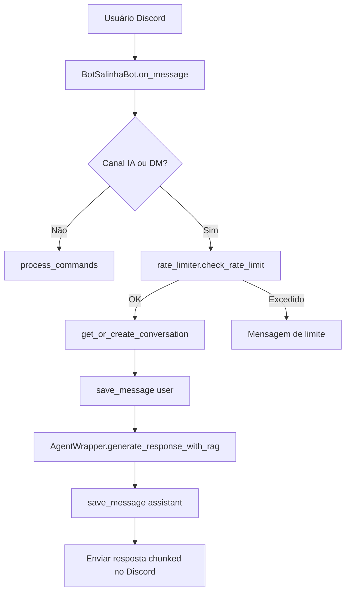
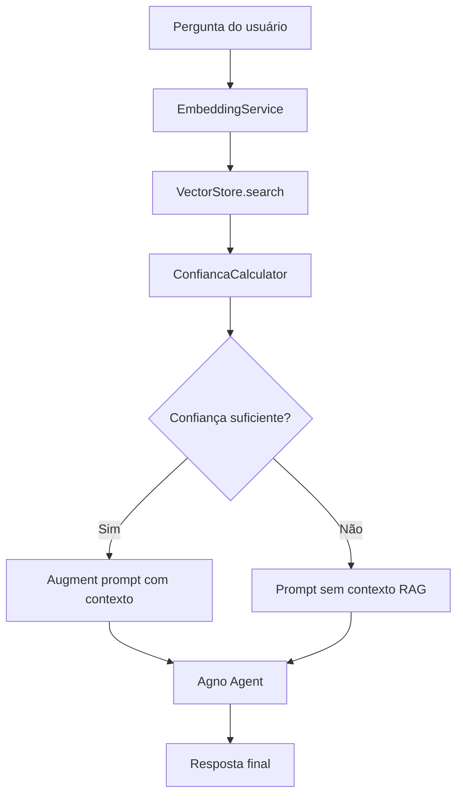
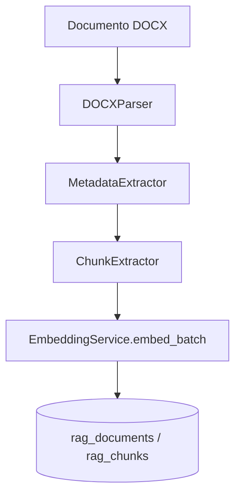

# Arquitetura do BotSalinha

Documento de referência arquitetural do projeto, atualizado com base no estado atual do
repositório (incluindo `repomix-output.xml`), para onboarding técnico e tomada de decisão.

## 1. Visão Geral

O BotSalinha é um bot de Discord orientado a direito brasileiro e concursos públicos, com:

- Interface principal via `discord.py` (comandos e mensagens automáticas em canal/DM)
- Geração de respostas por agente Agno (`openai` e `google` via `config.yaml`)
- Persistência assíncrona em SQLite com SQLAlchemy
- Pipeline RAG para recuperação semântica de contexto jurídico
- Observabilidade com `structlog`, `correlation_id` e sanitização de dados sensíveis

## 2. Estrutura do Projeto

```text
BotSalinha/
├── src/
│   ├── config/          # Settings (.env), loader de config.yaml e MCP config
│   ├── core/            # Bot Discord, agente, CLI e ciclo de vida
│   ├── middleware/      # Rate limiter
│   ├── models/          # ORM e modelos de domínio (conversa/mensagem/RAG)
│   ├── rag/             # Parser, serviços, storage e utilitários de RAG
│   ├── storage/         # Repositório SQLite e interfaces
│   ├── tools/           # MCP tools manager
│   └── utils/           # Erros, logging, retry, correlação e sanitização
├── tests/
│   ├── unit/
│   ├── integration/
│   ├── e2e/
│   ├── load/
│   └── fixtures/
├── docs/                # API, arquitetura, operações, deploy, guia dev
├── migrations/          # Migrações Alembic
├── scripts/             # Scripts de ingestão, backup e testes auxiliares
├── config.yaml          # Provider/modelo/prompt/comportamento do agente
├── .env(.example)       # Credenciais e parâmetros de runtime
└── pyproject.toml       # Dependências e tooling Python/uv
```

## 3. Fluxos Principais

### 3.1 Fluxo de Mensagem Discord



### 3.2 Fluxo de Geração com RAG



### 3.3 Fluxo de Ingestão RAG



## 4. Componentes e Responsabilidades

### 4.1 Entrada e Orquestração

- `bot.py` e `src/main.py`: pontos de entrada
- `src/core/cli.py`: CLI de operação/desenvolvimento
- `src/core/discord.py`: comandos, mensagens automáticas, erros e integração com agente
- `src/core/agent.py`: orquestra Agno + histórico + RAG + MCP

### 4.2 Configuração

- `src/config/settings.py`: `BaseSettings` com variáveis de ambiente
- `src/config/yaml_config.py`: valida e carrega `config.yaml`
- `src/config/mcp_config.py`: contrato para servidores MCP

### 4.3 Persistência

- `src/storage/repository.py`: interfaces abstratas de repositório
- `src/storage/sqlite_repository.py`: implementação assíncrona SQLite
- `src/storage/factory.py`: `create_repository()` com lifecycle controlado

### 4.4 RAG

- Parser: `src/rag/parser/docx_parser.py`, `src/rag/parser/chunker.py`
- Serviços: `embedding_service.py`, `cached_embedding_service.py`, `query_service.py`,
  `ingestion_service.py`
- Storage: `src/rag/storage/vector_store.py`, `src/rag/storage/rag_repository.py`
- Utilitários: `confianca_calculator.py`, `metadata_extractor.py`, `normalizer.py`

### 4.5 Observabilidade e Resiliência

- Logging: `src/utils/logger.py`, `log_events.py`, `log_correlation.py`, `log_sanitization.py`,
  `log_rotation.py`
- Retry/backoff: `src/utils/retry.py`
- Erros de domínio: `src/utils/errors.py`
- Rate limiting: `src/middleware/rate_limiter.py`

## 5. Modelo de Dados

### 5.1 Tabelas de Conversação

- `conversations`: sessão por usuário/guild/canal
- `messages`: histórico de mensagens `user`/`assistant`

### 5.2 Tabelas RAG

- `rag_documents`: metadados de cada documento indexado
- `rag_chunks`: chunks com metadados e embedding serializado (`LargeBinary`)

### 5.3 Migrações

As alterações de schema são controladas por Alembic em `migrations/versions/`.

## 6. Configuração e Feature Flags

### 6.1 Variáveis de ambiente (`.env`)

- Credenciais: `DISCORD_BOT_TOKEN`, `OPENAI_API_KEY`, `GOOGLE_API_KEY`
- Banco/rate limit/logging/runtime: via `settings.py`
- Padrão nested: `DATABASE__URL`, `RATE_LIMIT__REQUESTS`, etc.

### 6.2 Configuração comportamental (`config.yaml`)

- `model.provider`: `openai` ou `google`
- `model.id`, `temperature`, `max_tokens`
- `prompt.file`: seleciona prompt ativo em `prompt/`
- `mcp.enabled` e servidores MCP

## 7. Integrações Externas

- Discord API (`discord.py`)
- Provedores de LLM:
  - OpenAI (`openai`)
  - Google Gemini (`google-genai`)
- MCP servers (opcional, via Agno MCPTools)

## 8. Testes e Qualidade

### 8.1 Estrutura de testes

- `tests/unit`: testes isolados
- `tests/integration`: integração entre camadas
- `tests/e2e`: fluxo fim a fim do bot
- `tests/load`: carga/performance para RAG

### 8.2 Tooling e qualidade

- Execução com `uv`
- Lint/format: Ruff
- Tipagem: mypy
- Cobertura mínima definida em CI

## 9. Decisões Arquiteturais Ativas

### 9.1 Estado híbrido DI + legado singleton

O projeto está em transição para injeção de dependência plena (`create_repository()`), mas ainda
existem pontos legados usando `get_repository()`. Novas implementações devem priorizar DI.

### 9.2 Persistência local (SQLite)

SQLite atende o cenário atual. Para escalabilidade horizontal/multi-réplica, o caminho natural é
migrar para banco centralizado.

## 10. Riscos e Próximos Passos

- Reduzir dependência de singleton em `core/lifecycle.py` e fluxos antigos
- Consolidar padrão de sessão para operações RAG e bot principal
- Evoluir documentação de contratos RAG (filtros/metadados por tipo jurídico)
- Reforçar automação de validação da documentação em CI

## 11. Referências Rápidas

- [README](README.md)
- [API](docs/api.md)
- [Guia de Desenvolvimento](docs/DEVELOPER_GUIDE.md)
- [Operações](docs/operations.md)
- [Deploy](docs/deployment.md)
- [ADR-001](docs/adr/ADR-001-multi-model-provider.md)

