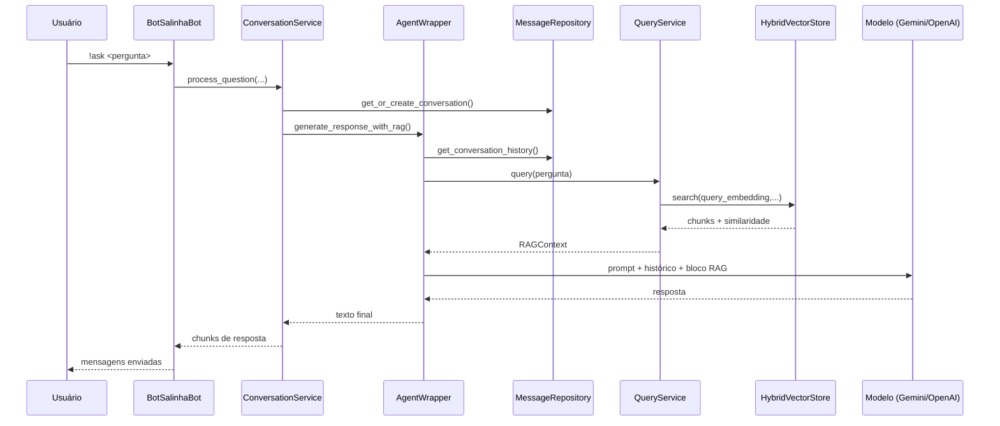
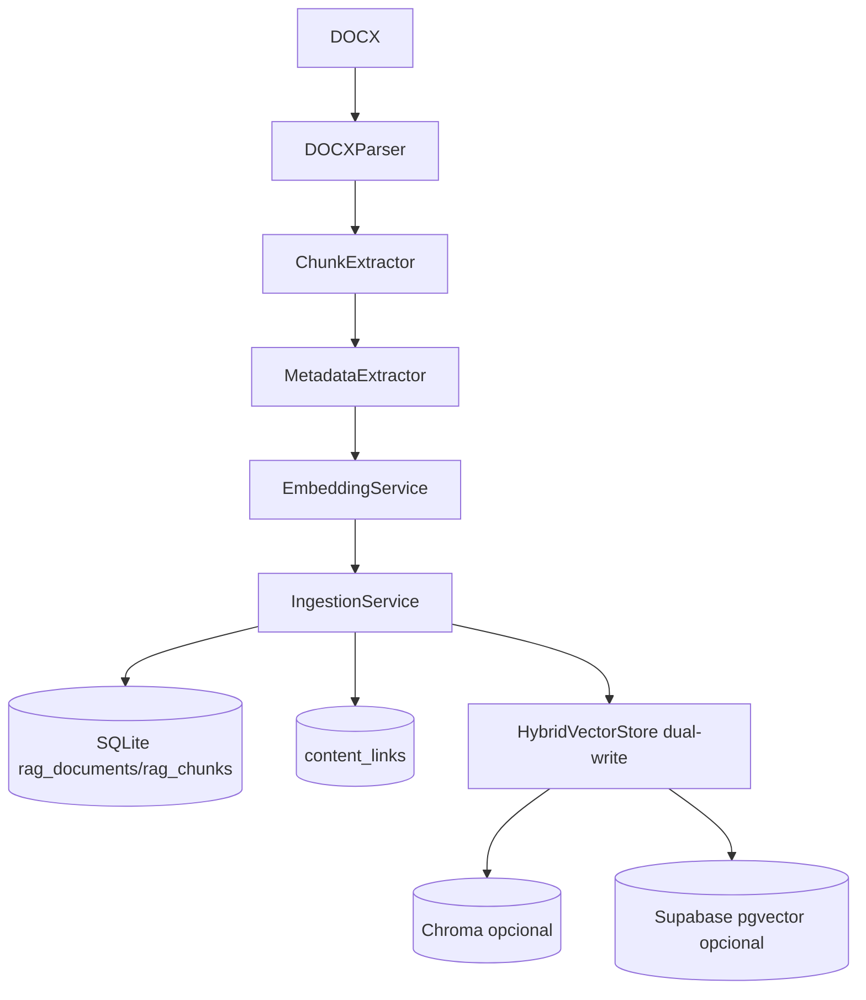

# Arquitetura do Sistema — BotSalinha (2026)

## 1. Visão Geral de Alto Nível

O BotSalinha é um assistente jurídico para Discord com arquitetura em camadas, combinando:
- Interface conversacional (`discord.py`)
- Orquestração de contexto e geração (AgentWrapper + Agno)
- Persistência conversacional (repositório configurável)
- Pipeline RAG jurídico (ingestão, embeddings, busca vetorial, rerank)

### Camadas principais

1. Apresentação: comandos/eventos Discord em `src/core/discord.py`.
2. Aplicação: orquestração de fluxo em `src/services/conversation_service.py` e `src/core/agent.py`.
3. Dados: repositórios (`SQLite`, `Convex`, `Supabase`) e modelos ORM.
4. RAG: parser/chunker/metadados, embeddings, busca vetorial híbrida em `src/rag/`.
5. Infra/config: `src/config/settings.py`, YAML de prompt/modelo, logging e retry.

## 2. Interações de Componentes

### Diagrama de componentes

```mermaid
flowchart LR
  U[Usuário Discord] --> D[BotSalinhaBot\ncore/discord.py]
  D --> CS[ConversationService]
  CS --> AR[AgentWrapper]

  AR --> MR[MessageRepository\n(SQLite/Convex/Supabase)]
  AR --> QS[QueryService\nquando RAG habilitado]

  QS --> ES[EmbeddingService]
  QS --> HVS[HybridVectorStore]

  HVS --> VS[VectorStore SQLite]
  HVS --> CH[ChromaStore opcional]
  HVS --> SB[SupabaseStore opcional]

  CS --> MS[MessageSplitter]
  MS --> D
  D --> U
```

### Interações críticas

- `BotSalinhaBot` recebe comando `!ask` e delega ao `ConversationService`.
- `ConversationService` carrega/cria conversa e delega geração ao `AgentWrapper`.
- `AgentWrapper` aplica sanitização, histórico e, se habilitado, enriquece prompt com contexto RAG.
- `QueryService` gera embedding de consulta, busca candidatos, rerankeia e retorna `RAGContext`.
- resposta final é fragmentada por `MessageSplitter` para respeitar limite de 2000 caracteres do Discord.

## 3. Diagramas de Fluxo de Dados

### 3.1 Fluxo de consulta (`!ask`)



### 3.2 Fluxo de ingestão de documentos RAG



## 4. Decisões de Design e Justificativa

1. Arquitetura em camadas.
Justificativa: isola responsabilidades e reduz acoplamento entre Discord, regra de negócio e persistência.

2. Repository pattern para mensagens/conversas.
Justificativa: permite trocar backend (SQLite local, Convex, Supabase) sem alterar a camada de aplicação.

3. RAG desacoplado em serviços (`QueryService`, `IngestionService`, `EmbeddingService`).
Justificativa: facilita evolução incremental de chunking, rerank e embeddings sem impacto no fluxo do bot.

4. `HybridVectorStore` com fallback.
Justificativa: tolerância a falhas e migração progressiva (SQLite como base estável, Chroma/Supabase opcionais).

5. Cache semântico no fast-path.
Justificativa: evita custo de LLM e leitura de histórico em consultas repetidas, reduzindo latência.

6. Normalização + extração de metadados jurídicos.
Justificativa: melhora precisão de recuperação para consultas por artigo/inciso/jurisprudência/questões.

7. Chunking com preservação semântica legal.
Justificativa: reduz alucinação por chunks poluídos e preserva contexto normativo.

## 5. Restrições e Limitações do Sistema

1. Limite de mensagem Discord (2000 chars).
Impacto: respostas longas são fragmentadas; UX depende de ordenação dos chunks.

2. Dependência de provedores externos de LLM/embeddings.
Impacto: latência variável, limites de taxa e custo por token/chamada.

3. Qualidade do RAG depende da ingestão.
Impacto: metadados ruins, chunking inadequado ou documentos heterogêneos degradam precisão.

4. Fallback de armazenamento vetorial.
Impacto: em falha de Chroma/Supabase, há degradação para SQLite (mais robusto, potencialmente menos escalável).

5. Custos de reindexação grandes.
Impacto: ingestão massiva de DOCX é demorada e pode exigir execução assíncrona com retomada.

6. Consistência eventual em modo dual-write.
Impacto: durante migração, pode existir descompasso temporário entre backends vetoriais.

7. Segurança operacional depende de gestão de segredos.
Impacto: chaves de API e credenciais de banco devem ficar fora de versionamento e com rotação periódica.

## Referências de Código

- `src/core/discord.py`
- `src/services/conversation_service.py`
- `src/core/agent.py`
- `src/rag/services/query_service.py`
- `src/rag/services/ingestion_service.py`
- `src/rag/storage/hybrid_vector_store.py`
- `src/rag/storage/supabase_store.py`
- `src/config/settings.py`
